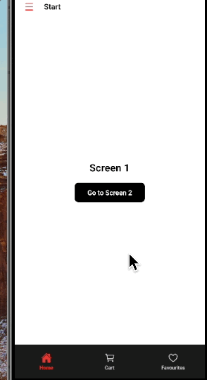

# React Native Navigation Project

A React Native application demonstrating advanced navigation patterns with custom animated drawer, tab navigation, and stack navigation.



## About

This project showcases a production-ready React Native application with:

- **Custom Animated Drawer** with 2D rotation effect using Reanimated
- **Three-level navigation hierarchy** (Drawer → Tabs → Stack)
- **Internationalization (i18n)** with English and Spanish support
- **TypeScript** throughout the entire codebase
- **Clean architecture** with separation of concerns

---

## Tech Stack

| Library                          | Version | Purpose                     |
| -------------------------------- | ------- | --------------------------- |
| `react`                          | 19.1.1  | UI framework                |
| `react-native`                   | 0.82.1  | Mobile development platform |
| `typescript`                     | 5.8.3   | Type safety                 |
| `@react-navigation/native`       | 7.1.18  | Navigation core             |
| `@react-navigation/native-stack` | 7.5.1   | Stack navigation            |
| `@react-navigation/bottom-tabs`  | 7.5.0   | Tab navigation              |
| `@react-navigation/drawer`       | 7.6.0   | Drawer navigation types     |
| `react-native-screens`           | 4.18.0  | Native screen optimization  |
| `react-native-safe-area-context` | 5.6.1   | Safe area handling          |
| `react-native-reanimated`        | 4.1.3   | High-performance animations |
| `react-native-gesture-handler`   | 2.29.0  | Touch gesture handling      |
| `react-native-worklets`          | 0.6.1   | Worklets support            |
| `react-native-vector-icons`      | 10.3.0  | Icon library (Ionicons)     |

---

## Project Structure

```
src/
├── components/           # Reusable UI components
│   ├── Button/
│   │   ├── index.tsx
│   │   └── styles.ts
│   ├── ErrorBoundary/   # Error boundary wrapper
│   ├── Header/          # Screen header with menu button
│   ├── MenuButton/      # Drawer toggle button
│   ├── TabIcon/         # Tab bar icon component
│   └── index.ts
│
├── navigation/          # Navigation configuration
│   ├── DrawerNavigator/ # Custom animated drawer
│   ├── TabNavigator/    # Bottom tab navigation
│   ├── HomeStack/       # Stack navigation
│   └── index.ts
│
├── screens/             # Screen components
│   ├── Cart/
│   ├── Favourites/
│   ├── Orders/
│   ├── Screen1/
│   ├── Screen2/
│   └── index.ts
│
├── hooks/               # Custom React hooks
│   ├── useTranslation.tsx  # i18n hook + provider
│   ├── useDrawer.ts        # Drawer context hook
│   ├── useTabIcons.ts      # Tab icon mapping
│   └── index.ts
│
├── theme/               # Design system
│   ├── colors.ts        # Color palette
│   ├── spacing.ts       # Spacing scale
│   └── index.ts
│
├── locales/             # Internationalization
│   ├── en-us.json       # English translations
│   ├── es.json          # Spanish translations
│   └── index.ts
│
├── enums/               # TypeScript enums
│   ├── DrawerScreens.ts
│   ├── TabScreens.ts
│   ├── HomeStackScreens.ts
│   └── index.ts
│
├── types/               # TypeScript type definitions
│   └── index.ts
│
├── constants/           # App constants
│   └── index.ts         # API URLs, animation configs
│
├── services/            # External services
│   └── api.ts           # HTTP client
│
├── errors/              # Error handling
│   ├── messages.json    # Error messages
│   └── index.ts
│
├── utils/               # Utility functions
│   └── index.ts
│
└── App.tsx              # Root component
```

---

## Navigation Hierarchy

```
DrawerNavigator (Root)
├── Start (default)
│   └── TabNavigator
│       ├── Home (default) → HomeStack
│       │   ├── Screen1 (default)
│       │   └── Screen2
│       ├── Cart
│       └── Favourites
└── Orders
```

---

## Internationalization (i18n)

- **2 Languages**: English (default) and Spanish
- **Custom Hook**: `useTranslation()` provides translations
- **Type-Safe**: Translations are typed from `en-us.json`

```typescript
const { t, locale, setLocale } = useTranslation();

<Text>{t.drawer.start}</Text>; // "Start" or "Inicio"
setLocale('es'); // Switch to Spanish
```

## Theme System

Centralized color palette in `src/theme/colors.ts`:

```typescript
export const colors = {
  primary: '#007AFF',
  secondary: '#5856D6',
  background: '#FFFFFF',
  backgroundDark: '#1a1a1a',
  text: '#1C1C1E',
  // ... 16 more colors
};
```

## Error Boundary

Production-ready error handling:

- Catches render errors gracefully
- Shows user-friendly error message
- "Try Again" button to recover
- Internationalized error messages
- Ready for error reporting service integration (Sentry, Bugsnag)

## Getting Started

### Prerequisites

- **Node.js**: >= 20.x
- **npm** or **yarn**
- **iOS**: Xcode 14+ and CocoaPods
- **Android**: Android Studio and SDK 33+

### Installation

1. **Clone the repository**

   ```bash
   git clone <repository-url>
   cd rnProjectX
   ```

2. **Install dependencies**

   ```bash
   npm install
   ```

3. **Install iOS pods** (macOS only)
   ```bash
   cd ios && pod install && cd ..
   ```

### Running the App

#### iOS (macOS only)

```bash
npm run ios
```

#### Android

```bash
npm run android
```

### Development

Start Metro bundler:

```bash
npm start
```

Run linter:

```bash
npm run lint
```

Run tests:

```bash
npm test
```

---
